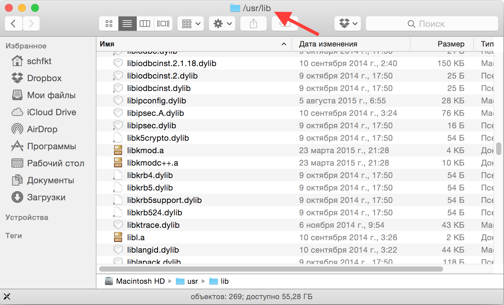

По-умолчанию, в OS X (подразумевается Yosemite) присутствуют некоторые особые
"фичи", которые немного мешают жить. Например, поехавший скролл, который
появляется только тогда, когда скроллишь. Если зажать какую-нибудь клавишу
(n, k и т.д.), то вылезает какое-то меню около курсора. Это вместо того,
чтобы просто непрерывно вводить этот символ в поле ввода. Список можно
продолжать до бесконечности. Хорошо хоть, что все эти "фичи" можно исправить.
Чему данный пост и посвящён.

# Возвращаем на место скроллбар

Для этого нужно пульнуть в терминале следующую команду:


defaults write NSGlobalDomain AppleShowScrollBars -string "Always"


Результат, правда, применится не сразу ко всем приложениям, а только к тем,
которые будут запущены после выполнения команды. Или это мне так показалось.
В любом случае, после рестарта OS X скроллбар будет везде и всегда виден.
Пример:

Возможные значения у этой опции следующие:

- WhenScrolling
- Automatic
- Always

Так что, при необходимости, можно всё вернуть как было.

# Включаем повтор клавиш

Собственно, команда для включения:


defaults write NSGlobalDomain ApplePressAndHoldEnabled -bool false


Также можно задать скорость повтора:


defaults write NSGlobalDomain KeyRepeat -int 2


Если указать 0, то повтор будет уж очень быстрый. Я поэкспериментировал и
подобрал значение 2. С ним выглядит оно так:

# Исправляем рендеринг шрифтов на внешних дисплеях

Кровь заструилась из глаз моих, когда я первый раз подключил внешний монитор к
макбуку. Шрифты были настолько адово шероховатые, что работать было совсем
невозможно. Решилась проблема при помощи следующей настройки:


defaults write NSGlobalDomain AppleFontSmoothing -int 2


# Отображение абсолютного пути к текущей папке в заголовке окна

Включается следующей командой:


defaults write com.apple.finder _FXShowPosixPathInTitle -bool true


Результат:

# Задаём вид отображения по-умолчанию


defaults write com.apple.finder FXPreferredViewStyle -string "Nlsv"


В качестве значения можно указать одну из следующих строк:

- "icnv" - значки
- "Nlsv" - список
- "clmv" - колонки
- "Flwv" - обложка

Чтобы было понятно, какой режим что из себя представляет, на следующей картинке
можно глянуть, какая из кнопок в UI Finder'а включает какой режим:

# Отключаем предупреждение при смене расширения у файла


defaults write com.apple.finder FXEnableExtensionChangeWarning -bool false


# Включаем отображение расширения у всех файлов


defaults write NSGlobalDomain AppleShowAllExtensions -bool true


# Отключаем прозрачность у элементов интерфейса (menu bar и прочее)

Совсем бесполезная хрень, которая к тому же только попусту напрягает
графический адаптер. Отключаем:


defaults write com.apple.universalaccess reduceTransparency -bool true


# Убираем тени на скриншотах

Тоже фигня бесполезная:


defaults write com.apple.screencapture disable-shadow -bool true


# Отключаем переход назад по истории в хроме при помощи свайпа влево

Иногда оно может быть удобно. Но обычно я этот жест делаю случайно. Выключаем:


defaults write com.google.Chrome AppleEnableSwipeNavigateWithScrolls -bool false


# Небольшие фиксы для Time Machine

Не нужно предлагать использовать для бэкапов внешние диски:


defaults write com.apple.TimeMachine DoNotOfferNewDisksForBackup -bool true


Выключаем локальные бэкапы (лол, apple, какой вообще в них смысл?). Да и место
только зря занимает:


sudo tmutil disablelocal


# Чаще проверяем наличие обновлений

В данном случае, каждый день:


defaults write com.apple.SoftwareUpdate ScheduleFrequency -int 1


# Улучшаем качество звука в blueetoth гарнитурах / наушниках

Сам пока что не проверял, ибо наушники поломались:


defaults write com.apple.BluetoothAudioAgent "Apple Bitpool Min (editable)" -int 40


# Полезные ссылки

Почти все эти команды я нашёл в скриптах, расположенных по следующим ссылкам:

- [https://github.com/mathiasbynens/dotfiles/blob/master/.osx](https://github.com/mathiasbynens/dotfiles/blob/master/.osx)
- [https://gist.github.com/brandonb927/3195465](https://gist.github.com/brandonb927/3195465)

Там же есть и множество других советов. Которые сюда не попали, ибо я просто не
стал их использовать.
