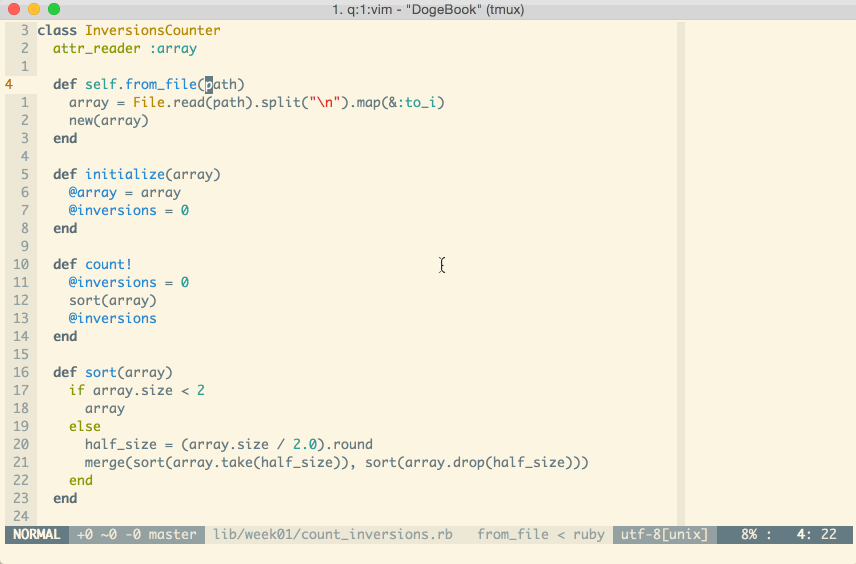

Совершенно случайно наткнулся в интернетах на такую замечательную вещь:
[Mastering vim](http://shop.oreilly.com/product/110000687.do). Это небольшой
(3,5 часа примерно) видео-курс по vim за авторством Damian Conway. По его
словам, он угорает в vi/vim уже 30 лет (я неслабо так удивлён). А значит, ему
есть о чём рассказать. Курс я посмотрел целиком, и оно того стоило. Узнал
оттуда о большом количестве команд, которые до этого совсем не встречал.
Собственно, данный пост -- это подборка различных советов и трюков, которые я
почерпнул, пока смотрел этот курс и лазил по документации в процессе.

# Help

Многие знают о команде `:help` (или короче: `:h`). Она невероятно полезная, ибо
что в документации самого vim, что в документации сторонних плагинов обычно всё
достаточно подробно расписано. Что какая команда как делает, какая настройка за
что отвечает и т.п. Только вот эта команда сразу переходит к первому
попавшемуся результату. Что не всегда оказывается тем, что требуется найти. И
здесь на помощь приходит `:helpgrep` (`:helpg`). Она же выводит результаты
поиска в Quickfix список. По этим результатам затем можно достаточно удобно
переходить при помощи следующих команд:

- `:cnext` -- перейти к следующей записи в Quickfix списке
- `:cprev` -- перейти к предыдущей записи
- `:cfirst` -- перейти к самой первой записи
- `:clast` -- перейти к самой последней записи

Разумеется, если результатов поиска достаточно много, то вводить эти команды
может стать утомительно. И здесь на помощь приходит плагин
[vim-unimpaired](https://github.com/tpope/vim-unimpaired) от вездесущего Tim
Pope, плагины которого уже заполонили половину моего vimrc. Этот плагин
добавляет большое количество полезных сочетаний клавиш. И среди них есть те,
которые упрощают работу с Quickfix списком. Вот они:

- `[q` -- `:cprev`
- `]q` -- `:cnext`
- `[Q` -- `:cfirst`
- `]Q` -- `:clast`

К тому же, их достаточно легко запомнить. Особенность всех сочетаний, которые
добавляет плагин, в том, что они так или иначе используют `[` или `]`. За
подробностями го в `:h unimpaired`.

И напоследок, два поисковых запроса, при помощи которых можно найти множество
интересных команд для normal и insert mode:

- `:h normal-index` -- откроет страницу хелпа, на которой перечислены все
  команды, доступные в normal mode
- `:h insert-index` -- аналогично, но для insert mode

# История изменений

Оказывается, история изменений в vim'е не линейная, а древовидная. А это
значит, что все сделанные измения можно восстановить. И помимо команд `u` и
`ctrl+r` присутствуют другие, которые как раз и позволяют перемещаться по
ветвям дерева, представляющего историю изменений. Рассмотрим пример:

- Создали новый файл
- Добавили строку: *"Как я тебе это чистить буду? Вилкой что ли?!"*
- Добавили ещё строку: *"Чисти, чисти, чисти. Раз-раз-раз."*
- Удалили эту сроку
- Добавили вместо неё строку: *"У тебя самого хорошо получается. Ты и чисти."*

Если воспользоваться командами `u` и `ctrl-r` в normal mode, то мы сможем
перемешаться в истории только по таким изменениям:

- *"Как я тебе это чистить буду? Вилкой что ли?!"*
- *"У тебя самого хорошо получается. Ты и чисти."*

Но мы не сможем вернуться на тот момент, когда была добавлена строка *"Чисти,
чисти, чисти. Раз-раз-раз."* Для этого существуют другие команды:

- `g-` -- переключиться на самое последнее измение в предыдущей ветви истории
- `g+` -- переключиться на самое последнее измение в следующей ветви истории

Другими словами, если сейчас мы находимся на том моменте, когда была добавлена
строка *"У тебя самого хорошо получается. Ты и чисти."*, то при помощи команды
`g-` мы можем вернуться к тому моменту, когда была добавлена строка *"Чисти,
чисти, чисти. Раз-раз-раз."*. А вернуться обратно уже можем при помощи `g+`.

Но всё это как-то сложно и к тому же не всегда может быть очевидно, а к какому
вообще моменту истории файла мы перейдём в итоге. Разумеется, для упрощения
жизни существует крутой плагин: [gundo.vim](https://github.com/sjl/gundo.vim).
Он визулизирует дерево изменений файла и показывает в виде диффа то, что было
изменено на конкретном шаге. Пример:

Подробнее про историю изменений и про плагин gundo.vim можно глянуть в этом
[скринкасте](http://vimcasts.org/episodes/undo-branching-and-gundo-vim/). Там,
помимо всего прочего, есть интерактивная иллюстрация того, как выглядит история
изменений.

Для истории измений существуют различные настройки. Одна из самых полезных --
это возможность сохранения истории на диске. Таким образом, она будет доступна
даже после того, как мы закроем файл или даже сам vim, а потом снова откроем.
Для включения необходимо добавить следующую строчку в .vimrc:


set undofile


По-умолчанию, файлы с историей изменений хранятся рядом с самими редактируемыми
файлами.  Что не совсем удобно. Это также настраивается:


set undodir=~/.vim/undo//


Стоит обратить внимание на `//` на конце. С такой настройкой vim будет создавать
файлы примерно следующего вида:


$ ll ~/.vim/undo
-rw-r--r--  1 schfkt  staff    55K 27 сен 14:37 %Users%schfkt%code%vim-examples%alice.txt
-rw-r--r--  1 schfkt  staff   2,3K 27 сен 14:39 %Users%schfkt%dotfiles%vimrc


Это позволит избежать конфликтов для файлов, имеющих одинаковые имена. Т.к.,
иначе vim (если просто указать какую-то директорию без `//`) для файла с
историей будет использовать имя аналогичное имени редактируемого файла.

Ещё одна полезная опция -- это количество записей в истории изменений.
По-умолчанию задано 1000.  Может быть маловато, поэтому я поменял на 5000:


set undolevels=5000


# Поиск и замена

До просмотра вышеупомянутого курса я как-то совсем плохо знал, как пользоваться
заменой в vim'е. Не так уж и часто приходилось это делать, поэтому синтаксис
команды постоянно улетучивался из памяти. Да и более сложные (с регэкспами,
например) поисковые запросы я практически не использовал.

Самая главная причина, из-за которой с регэкспами в vim'е у меня не сразу
заладилось, лежит в том, что почти все спецсимволы в регэкспах (`+`, `*`, `?` и
т.д.) нужно экранировать обратным слэшем. Например, если мы хотим найти
несколько идущих подряд чисел, то регэксп для этого будет выглядеть так:
`\d\+`. А не `\d+`, как можно было подумать. В случае же, если таких
спецсимволов в регэкспе много, то это быстро может надоесть (никто же не любит
делать одни и те же повторяющиеся действия). Чтобы решить эту проблему, можно
добавлять к регэкспам префикс `\v`.  Если верить документации, он включает
особый -- *"very magic"* -- режим работы регэкспов:

> Use of "\v" means that in the pattern after it all ASCII characters except
> '0'-'9', 'a'-'z', 'A'-'Z' and '\_' have a special meaning.  "very magic"

В нём почти все символы считаются специальными. Вот вам два аналогичных
регэкспа для сравнения:

- `\v(чисти-?){3}`
- `\(чисти-\?\)\{3\}`

Первый, на мой взгляд, куда привычнее. Да и его проще написать.

Ещё одна особенность регэкспов в том, что для границ слова в них используется
не `\b`, а другие символы:

- `\<` -- для левой границы слова
- `\>` -- для правой

Например, если мы хотим найти отдельное слово *"VIM"*, то регэксп для этого будет
выглядеть так: `\<VIM\>`. Причём под словом в vim'е подразумевается следующее
(см. `:h word`):

> A word consists of a sequence of letters, digits and underscores, or a
> sequence of other non-blank characters, separated with white space (spaces,
> tabs, \<EOL>).  This can be changed with the 'iskeyword' option.  An empty line
> is also considered to be a word.

А это значит, что регэксп `\<VIM\>` найдёт *"VIM"* в строке: *"I heard you like
VIM"*. Но не найдёт ничего в строке: *"OMG_LOL_VIM_WOW"*.

Перейдём к замене. Самый простой пример данной команды выглядит так:


:s/doge/wow


В этом случае в строке, на которой находится курсор, самый первый фрагмент
текста *"doge"* будет заменён на *"wow"*. Именно так. И если в строке имеются
два таких фрагмента, то второй останется неизменённым. Чтобы заменить все
найденные фрагменты текста нужно воспользоваться флагом `g`:


:s/doge/wow/g


И разумеется здесь можно использовать регэкспы:


:s/\d\+/<NUMBER>/g


Также для этой команды (да и вообще для любых других команд в command mode)
можно указать диапазон строк. Существует большое количество способов того, как
его можно указать (`:h range`). Я лишь перечислю те, которые мне запомнились:

- Со строки 1 по строку 100:


:1,100s/beep/boop/g
light

- Строки относительно текущей. В данном случае замена будет сделана на текущей
  строке, на 10 строках выше и на 20 ниже:


:-10,+20s/beep/boop/g


- Начиная с текущей строки. Чтобы заменить на текущей строке и на 10 строках
  ниже неё:


:.,+10s/beep/boop/g


- С какой-либо строки и до конца файла:


:10,$s/beep/boop/g


- Весь файл (шорткат для `1,$`):


:%s/beep/boop/g


Ещё у команды замены есть довольно полезная опция `c`, например:


:%s/and/end/gc


Если указать её, то перед заменой каждого совпадения vim будет спрашивать
действие:

Описание опций:

- `y` -- заменить текущее совпадение и перейти к следующему
- `n` -- не заменять текущее совпадение и перейти к следующему
- `a` -- заменить текущее и все остальные найденные совпадения
- `l` -- заменить текущее совпадение и остановиться
- `q` -- не заменять текущее совпадение и остановиться
- `^E` и `^Y` у меня почему-то не захотели работать, да и в документации ничего
  толком не удалось найти

Вооружившись полученными знаниями, я навернул себе полезный маппинг:


nnoremap <Leader>r :.,$s/\<<C-r><C-w>\>//gc<left><left><left>


Это заклинание заменяет слово, на котором расположен курсор, на то, что вы
укажете. Делает оно это начиная с текущей строчки и до конца файла. При этом
указана опция `c`, которая позволяет выбирать что конкретно менять, а что нет.
Этот маппинг я использую в основном для переименовывания переменных, методов и
т.д. Довольно удобно. Например:

Кстати, в normal mode есть пара команд, связанных с заменой:

- `&` -- повторить на текущей строке предыдущую команду замены
- `g&` -- повторить на всём файле предыдущую команду замены

А теперь перейдём к команде `:g`. Она позволяет выполнить какую-либо команду
для строк, которые будут найдены заданным поисковым запросом. Например:


:g /^\s/ :center


В данном случае, vim отцентрирует текст в строках, которые содержат хотя бы
один пробел в начале.  Как говорится, лучше один раз увидеть:

Пример покруче:

Да, да. При помощи `:normal` можно выполнять команды из normal mode прямо в
command mode. Это очень круто.

И чуть не забыл: ещё есть `:g!`. Она похожа на `:g`, только выполняет команды
для тех строк, которые не удовлетворяют поисковому запросу.

# Insert mode

В vim есть такая вещь как регистры. Они вовлечены во множество выполняемых
операций (копирование, удаление, макросы, и т.д.). Здесь можно почитать о них
подробнее: [Advanced Vim
registers](http://blog.sanctum.geek.nz/advanced-vim-registers/). Или же можно
посмотреть справку: `:h registers`. Так вот, для insert mode есть довольно
полезное сочетание клавиш, при помощи которого можно вставить содержимое
регистра в буфер: `ctrl+r a`. Где `a` -- имя регистра.  Можно записать макрос в
какой-нибудь из регистров, вставить его в буфер, отредактировать и записать
полученный текст обратно в регистр. Таким образом можно поправить макрос.
Вариантов применения можно найти много.

Эту фичу круто использовать с регистром `=`. Если в insert mode нажать
`ctrl+r =`, то vim попросит ввести выражение. Например, можно ввести `60 * 60 * 24`
и нажать Enter. Vim это выражение выполнит и результат вставит в буфер.

А вот ещё парочка полезных команд для insert mode:

- `ctrl+t` -- увеличить отступ для текущей строки
- `ctrl+d` -- уменьшить отступ для текущей строки
- `ctrl+o` -- позволяет переключиться в normal mode для выполнения всего одной
  команды. После выполнения которой vim обратно переключается в insert mode.
  Например, можно быстренько удалить все символы от курсора и до конца строки, а
  затем автоматически вернуться в insert mode: `ctrl+o D`.
- `ctrl+a` -- вставить тот фрагмент текста, который был вставлен за предыдущий
  сеанс работы в insert mode. Например:

  

# Normal mode

Очередь за normal mode. Здесь особо расписывать нечего, поэтому просто приведу
список команд с кратким описанием:

- `ZZ` -- делает тоже самое, что и `:x`
- `ZQ` -- тоже самое, что и `:q!`
- `ge` -- перейти на конец предыдущего слова. Как `e`, только в обратном
  направлении.
- `ctrl-g` -- выведет информацию о файле в самом низу окна vim. Например:
  *"alice.txt" line 15 of 15 --100%-- col 28*. Вообще, всю эту информацию можно
увидеть в status bar, если настроить его соответствующим образом.

Хотя, одна команда таки заслуживает более подробного описания. Это
`gq{motion}`. Она выполняет переформатирование текста. Например, `gqip`
позволяет автоматически переформатировать параграф текста таким образом, что
строки в нём по длине не будут превышать 81 символ (или сколько у вас задано в
настройках). Часто использую её при написании блогозаписей. И снова, лучше один
раз увидеть:

# Visual mode

Оказывается, между разными типами visual mode можно переключаться. Например:

- Переходим в visual line mode (`V`) и выбираем пару строк.
- Нажимаем `ctrl+v`, и vim переключается в visual block mode. Сохранив при этом
  выделение, но поменяв его соответствующим образом.
- Нажимаем `v`, и vim переключается в visual mode.

И снова гифка:

А вот visual block mode имеет пару очень крутых возможностей. Дальше и пойдёт
речь о них.

`<c-v>{motion}I{text}` позволяет выделить некоторый блок текста и вставить
перед ним на каждой строке определённый текст. Например, `<c-v>5jI>> <Esc>`:

`<c-v>{motion}A{text}` аналогичен предыдущему, но текст вставляется после
каждой строки выделенного блока. Например, `<c-v>5jA >>>><Esc>`:

`<c-v>{motion}c{text}` -- при помощи этого можно заменить текст в блоке.
Например, `<c-v>5jec COOKIES! <Esc>`:

И последнее: `<c-v>{motion}r{char}`. Заменяет каждый символ в выделенном блоке
на указанный. Например, `<c-v>5j$r*`:

Кстати, для normal mode есть ещё команда `gv`. Она позволяет повторить
предыдущую операцию выделения.

# Command mode

Ну а для command mode у меня припасён всего лишь один совет -- это команда
`ctrl-f`. Она позволяет редактировать вводимые команды, используя так привычные
нам insert mode и normal mode. Эта фича прям очень упрощает жизнь при вводе
каких-то длинных команд в command mode.

# Заключение

Довольно объёмный пост получился. Надеюсь, кому-нибудь он поможет стать
продуктивнее в vim'е. Ну а если у вас есть идеи (какие-нибудь команды, удобные
мапинги и пр.), то просьба постить их в комментарии.
