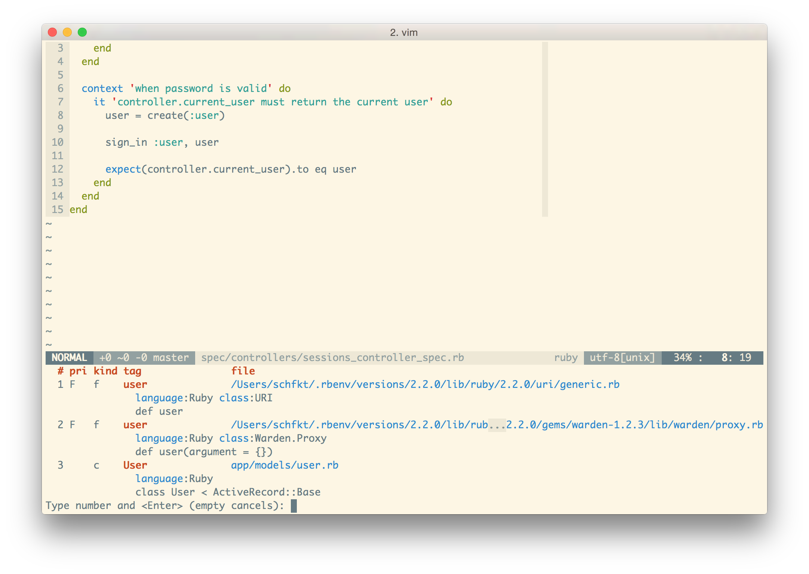

Посмотрел недавно [скринкаст](http://www.pluralsight.com/courses/play-by-play-aaron-patterson)
с Aaron Patterson (который @tenderlove). Понравилось, как он владеет vim'ом.
Больше всего запомнилось то, как Aaron шарился по документации прямо в исходниках
гемов. И вот для быстрого поиска нужного метода он как раз использовал встроенную
в vim поддержку ctags. Я же этой фичей вообще не пользовался, хотя и знал о ней.
Решил, что надо бы попробовать, и не пожалел.

# Установка и настройка ctags

В OS X из коробки есть какой-то бинарник ctags, но он неправославный.
Нам же нужен exuberant ctags. Накатим его при помощи homebrew и возрадуемся:


$ brew install ctags


И дабы убедиться, что ctags стал православным, запустим команду:


$ ctags --version
Exuberant Ctags 5.8, Copyright (C) 1996-2009 Darren Hiebert
  Compiled: Mar 16 2015, 23:48:18
  Addresses: <dhiebert@users.sourceforge.net>, http://ctags.sourceforge.net
  Optional compiled features: +wildcards, +regex


Для ctags можно создать глобальный конфиг, чтобы постоянно не указывать гору опций
при его запуске. Положить его нужно в `~/.ctags`:


$ cat ~/.ctags
--recurse=yes
--tag-relative=yes
--fields=+l
--languages=ruby,javascript
--exclude=.git
--exclude=node_modules
--exclude=log
--exclude=*.min.js


Oписание опций:

+ `--recurse=yes` -- указывает, что при поиске файлов для сканирования заданную
директорию нужно обходить рекурсивно.
+ `--tag-relative=yes` -- в тэг-файле пути к просканированным файлам будут указываться
относительно этого самого тэг-файла.
+ `--fields=+l` -- необходимо для плагина YouCompleteMe. Об этом чуть ниже.
+ `--languages=ruby,javascript` -- теги для каких языков генерировать. Список всех
поддерживаемых языков можно получить, запустив `ctags --list-languages`.
+ `--exclude` -- какие файлы/папки не сканировать.

# Используем ctags с vim'ом

Чтобы vim'у откуда было брать идентификаторы (они же тэги),
нужно сперва запустить ctags, который в свою очередь сгенерирует файл с ними:


$ ctags
$ ll tags
-rw-r--r--  1 schfkt  staff    13K 28 июн 22:05 tags


По-дефолту, vim как раз ищет тэги в файле tags в директории, в которой он запущен.
Поэтому больше ничего конфигурировать не нужно и можно опробовать на деле
следующие хоткеи/команды в vim'е:

+ `CTRL-]` -- перейти к определению идентификатора, на котором сейчас расположен
курсор.
+ `g]` -- вывести список всех мест, где находится идентификатор под курсором.
+ `CTRL+t` -- вернуться назад (после перехода по тэгу).
+ `:tag destroy` -- найти ключевое слово destroy. Аналогично тому, что делает `CTRL+]`.

Мне хватает этих команд, но на самом деле их гораздо больше. Полный список можно
глянуть в хелпе (`:h tags`).

Важный момент: после внесения изменений в код, ctags нужно запускать снова. Чтобы
новые идентификаторы добавились в tags-файл. Делать это руками каждый раз
утомительно. Но автоматизировать процесс можно, добавив следующую строчку в
.vimrc:


au BufWritePost *.js,*.rb silent! !ctags 2> /dev/null &


Таким образом Vim, после каждой записи в файл с расширением rb или js, будет
запускать команду `ctags 2> /dev/null &`.

# Примеры использования команд в vim'е

Описание всех этих команд на словах может быть не совсем ясно. Особенно тому,
кто и не знал об их существовании. Поэтому далее я приведу парочку наглядных
примеров с экраноснимками.

Например, сейчас мы находимся в каком-то спеке, курсор расположен на `User`:

Жмём `CTRL+]` и оказываемся в этой самой модельке `User`.

Чтобы вернуться назад в спек, можно воспользоваться комбинацией `CTRL+t`.
Аналогично, к этой модельке можно перейти при помощи команды `:tag User`.

`g]` команда выводит список всех мест где найден идентификатор, расположенный
под курсором:

# Интеграция с другими плагинами

## YouCompleteMe

Этот плагин может собирать идентификаторы из файлов с тэгами и использовать
эти идентификаторы для автодополнения. Чтобы воспользоваться фичей, необходимо:

+ При генерации тегов запускать ctags с параметром `--fields=+l`
+ Включить фичу, добавив строчку в .vimrc:


let g:ycm_collect_identifiers_from_tags_files = 1


## ctrlp.vim

CtrlP -- это такой прикольный плагин, при помощи которого можно быстро переходить
к чему угодно (файлам, буферам, тэгам etc.). Он выводит список чего-то, и этот
список можно фильтровать, начиная печатать текст. Из коробки плагин умеет выводить
тэги и позволяет переходить к ним. Чтобы вывести список тэгов, нужно пульнуть
`:CtrlPTag`. Снизу появится окошко с тэгами:

На скриншоте видно, что список тэгов отфильтрован по `create_table`. Для перехода
по тэгу достаточно нажать `Enter`. У меня для удобства команда повешена на
хоткей:


nnoremap <leader>t :CtrlPTag<CR>


## Tagbar

Экраноснимок лучше тысячи слов:

Вот эта панелька справа и есть Tagbar. Он собирает идентификаторы и отображает
их относительно классов, модулей etc. Довольно удобно. К идентификатору можно
также перейти, достаточно нажать `Enter`. При этом Tagbar не нуждается в
заранее сгенерированном файле с тэгами. Он генерирует его сам на лету и хранит
в памяти.

# Всякие годные штуки для ruby

Братишка Tim Pope угорел и навернул достаточное количество всяких гемов и плагинов,
которые сильно упрощают работу с ruby в vim'е. О них и пойдёт дальнейшее
повествование.

## Генерируем тэги для stdlib и гемов

Если вы, как и я, используете rbenv вместе с плагином ruby-build, то можно
дополнить их другим плагином. После установки новой версии ruby при помощи ruby-build,
он будет автоматически генерировать тэги для стандартной библиотеки этих самых ruby.
Выполним следующие шаги:

- Устанавливаем [плагин для rbenv](https://github.com/tpope/rbenv-ctags):


$ git clone git://github.com/tpope/rbenv-ctags.git \
    ~/.rbenv/plugins/rbenv-ctags


- Запускаем `rbenv ctags`, чтобы сгенерировать тэги для активной версии ruby. Или
же `rbenv ctags 2.2.0`, чтобы сгенерировать тэги для версии 2.2.0. В
дальнейшем тэги будут генерироваться автоматически после каждой установки
новой версии ruby.

Осталось автоматизировать генерацию тэгов для гемов. Для этого вышеупомянутый
Tim Pope напилил [другой гем](https://github.com/tpope/gem-ctags).

- Устанавливам гем:


$ gem install gem-ctags


- Генерируем тэги для уже установленных гемов:


$ gem ctags


Делать всё это каждый раз руками после установки новой версии ruby не труъ.
Автоматизируем процесс при помощи плагина
[rbenv-default-gems](https://github.com/sstephenson/rbenv-default-gems), который
как раз и занимается накатыванием заданных гемов после установки ruby.

- Установим плагин:


$ git clone git@github.com:sstephenson/rbenv-default-gems.git \
    ~/.rbenv/plugins/rbenv-default-gems


- Создадим для него конфиг со следующим содержимым:


$ cat ~/.rbenv/default-gems
gem-ctags


Ну вот, теперь тэги у нас будут генерироваться автоматически как для стандартной
библиотеки ruby, так и для устанавливаемых гемов. Осталось заставить vim использовать
эти тэги.

## Прикручиваем всё это дело к vim'у

Чтобы vim начал использовать все эти тэги, которые мы нагенерим для ruby, нужно
накатить парочку плагинов за авторством того же самого Tim Pope.

Первым делом установим плагин [vim-rbenv](https://github.com/tpope/vim-rbenv).
Этот плагин указывает vim'у путь до используемой версии ruby и до файла с тэгами
для неё. С этим плагином может возникнуть проблема, если вы используется в
качестве шелла zsh. Vim попросту будет использовать всегда системную версию
ruby вместо выбранной. На странице плагина есть пара вариантов решения этой проблемы.
Мне же помогло следующее:


$ sudo mv /etc/{zshenv,zshrc}


После рестарта шелла проблема исчезла.

Теперь установим плагин [vim-bundler](https://github.com/tpope/vim-bundler). Он
будет указывать vim'у пути до тэгов от гемов, указанных в соответствующем Gemfile.

# Заключение

Вот, собственно, и всё. Теперь у вас vim'е должнен быть сносный автокомплит, который
дополняет идентификаторы и из stdlib, и из гемов, и из вашего кода. Да и все эти
идентификаторы можно будет быстро и удобно искать. Картиночка напоследок:

